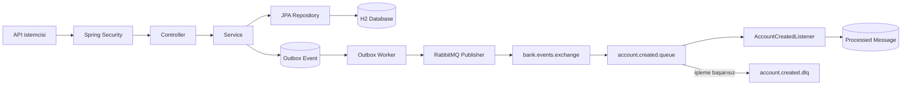

# Bank Service

Bu projeyi Java ve Spring Boot ekosisteminde öğrendiğim backend geliştirme
konularını gerçek bir senaryo üzerinde uygulamak amacıyla geliştirdim. Projede
kullanıcı kaydı ve kimlik doğrulama, banka hesabı yönetimi, para yatırma ve para
çekme işlemlerinin yanında güvenlik, eş zamanlılık, mesajlaşma ve veri tabanı
versiyonlama konularına odaklandım.

Projenin temel amacı yalnızca çalışan bir CRUD uygulaması oluşturmak değil;
üretim ortamlarında karşılaşılabilecek veri tutarlılığı ve mesaj güvenilirliği
problemlerine anlaşılır çözümler geliştirmekti.

## Kullandığım Teknolojiler

- Java 17
- Spring Boot 4.1
- Spring Web MVC
- Spring Data JPA ve Hibernate
- Spring Security ve HTTP Basic Authentication
- H2 Database
- Flyway
- RabbitMQ ve Spring AMQP
- Springdoc OpenAPI / Swagger UI
- Maven
- JUnit 5 ve Mockito
- Lombok

## Projede Neler Yaptım?

- Kullanıcı kayıt ve giriş işlemlerini geliştirdim.
- Şifreleri BCrypt ile hashleyerek veri tabanında açık metin olarak
  saklanmalarını engelledim.
- `CUSTOMER` ve `ADMIN` rolleriyle endpoint bazlı yetkilendirme uyguladım.
- Kullanıcıların hesap oluşturmasını, sorgulamasını ve silmesini sağladım.
- Para yatırma ve çekme işlemlerinde `BigDecimal` kullandım.
- Kullanıcının başka bir kullanıcıya ait hesaba erişmesini engelleyerek IDOR
  açığına karşı sahiplik kontrolü uyguladım.
- Eş zamanlı para çekme işlemlerinde veri tutarlılığını korumak için optimistic
  ve pessimistic locking kullandım.
- Hesap oluşturma olaylarını RabbitMQ üzerinden yayınladım.
- Veri tabanı işlemi başarılı olduğu hâlde mesajın kaybolması riskine karşı
  Transactional Outbox Pattern uyguladım.
- Aynı mesajın birden fazla kez işlenmesini önlemek için idempotent consumer
  yaklaşımı kullandım.
- Başarısız mesajlar için retry ve dead-letter queue yapısı oluşturdum.
- Veri tabanı şemasını Flyway migration dosyalarıyla versiyonladım.
- Hataları merkezi bir `GlobalExceptionHandler` ile HTTP cevaplarına
  dönüştürdüm.
- Unit ve integration testlerle servis, mesajlaşma, outbox ve eş zamanlılık
  davranışlarını doğruladım.
- API sözleşmesini Springdoc OpenAPI ile dokümante ettim.

## Mimari

Uygulamada katmanlı mimari kullandım. Controller katmanını ince tutarak iş
kurallarını service katmanına, veri erişimini repository katmanına taşıdım.
Swagger anotasyonlarının controller'ı kalabalıklaştırmaması için API
sözleşmesini `BankControllerApi` interface'inde tanımladım.



## Transactional Outbox Akışı

Hesap oluşturma ve RabbitMQ mesajı gönderme işlemleri farklı sistemlerde
gerçekleştiği için doğrudan mesaj göndermek veri kaybı riski oluşturuyordu. Bu
nedenle hesap ve outbox kaydını aynı veri tabanı transaction'ı içinde
kaydediyorum.

1. Kullanıcı yeni bir banka hesabı oluşturur.
2. `BankService`, banka hesabını ve `PENDING` durumundaki outbox kaydını aynı
   transaction içinde kaydeder.
3. `OutboxWorker`, belirli aralıklarla bekleyen kayıtları bulur.
4. `OutboxEventProcessor`, JSON payload'u `AccountCreatedEvent` nesnesine
   dönüştürür.
5. `AccountCreatedPublisher`, olayı RabbitMQ exchange'ine gönderir.
6. RabbitMQ mesajı routing key üzerinden ilgili queue'ya yönlendirir.
7. Mesaj kabul edilirse outbox kaydı `PUBLISHED` durumuna geçer.
8. Gönderim başarısız olursa retry sayısı ve son hata kaydedilir.
9. Maksimum deneme sayısına ulaşıldığında kayıt `FAILED` olur ve admin
   endpoint'i üzerinden yeniden kuyruğa alınabilir.

Consumer tarafında işlenen event kimliklerini `processed_message` tablosunda
saklıyorum. Aynı event tekrar gelirse ikinci kez işlenmesini engelliyorum.

## Eş Zamanlılık ve Locking

Aynı hesaptan aynı anda iki para çekme isteği geldiğinde iki thread'in de eski
bakiyeyi okuyup para çekmesi race condition oluşturabilir. Bu problemi iki
yaklaşımla inceledim:

- **Optimistic locking:** `BankAccount` içindeki version alanıyla kayıt
  güncellenirken verinin başka bir transaction tarafından değiştirilip
  değiştirilmediğini kontrol ediyorum.
- **Pessimistic locking:** Para çekme sırasında ilgili veri tabanı satırını
  `PESSIMISTIC_WRITE` ile kilitleyerek diğer transaction'ın güncel bakiyeyi
  bekleyip okumasını sağlıyorum.

Bu davranışı iki thread'i aynı anda başlatan bir integration test ile
doğruladım. Başlangıç bakiyesi `100.00` iken iki ayrı `80.00` çekim isteğinden
yalnızca biri başarılı olur ve son bakiye `20.00` kalır.

## Güvenlik

Projede HTTP Basic Authentication kullanıyorum. Spring Security, kullanıcıyı
`AppUserRepository` üzerinden bulur ve girilen ham şifreyi veri tabanındaki
BCrypt hash ile karşılaştırır.

- Kayıt, giriş, H2 Console ve Swagger adresleri herkese açıktır.
- Banka hesabı işlemleri `CUSTOMER` veya `ADMIN` rolü gerektirir.
- Tüm hesapları listeleme ve kullanıcı silme işlemleri `ADMIN` rolü gerektirir.
- Başarısız outbox kaydını yeniden kuyruğa alma işlemi `ADMIN` rolü gerektirir.
- Hesap sorgulama, para yatırma, para çekme ve hesap silme işlemlerinde hesap
  numarasıyla birlikte oturum açmış kullanıcının adı da sorguya eklenir. Böylece
  bir kullanıcı başka bir kullanıcıya ait hesabı yalnızca hesap numarasını
  değiştirerek görüntüleyemez veya değiştiremez.

## Veri Tabanı Migration'ları

Hibernate için `ddl-auto=validate` kullandım. Hibernate'in şemayı kendiliğinden
değiştirmesi yerine veri tabanı değişikliklerini Flyway ile yönetiyorum.

| Migration | Amaç |
| --- | --- |
| `V1__create_initial_schema.sql` | Kullanıcı ve banka hesabı tablolarını oluşturur. |
| `V2__create_processed_message_table.sql` | İşlenen RabbitMQ mesajlarını takip eder. |
| `V3__create_outboc_event_table.sql` | Transactional outbox tablosunu oluşturur. |
| `V4__change_balance_to_decimal.sql` | Para alanını decimal yapısına dönüştürür. |
| `V5__add_version_to_bank_account.sql` | Optimistic locking için version alanını ekler. |

Uygulama başlarken Flyway yalnızca daha önce çalıştırılmamış migration'ları
sırayla uygular ve sonucu `flyway_schema_history` tablosunda saklar.

## Projeyi Çalıştırma

### Gereksinimler

- JDK 17 veya üzeri
- Docker Desktop veya yerel RabbitMQ kurulumu
- Git

### 1. Projeyi Klonlama

```powershell
git clone https://github.com/bereberket/controllerservicesrepowithdto.git
cd controllerservicesrepowithdto
```

### 2. RabbitMQ'yu Docker ile Başlatma

```powershell
docker run -d --name bank-rabbit `
  -p 5672:5672 `
  -p 15672:15672 `
  -e RABBITMQ_DEFAULT_USER=bankuser `
  -e RABBITMQ_DEFAULT_PASS=bankpass `
  -v bank-rabbit-data:/var/lib/rabbitmq `
  rabbitmq:4-management
```

Uygulamayı çalıştırmadan önce aynı terminalde bağlantı bilgilerini tanımlarım:

```powershell
$env:RABBITMQ_USERNAME="bankuser"
$env:RABBITMQ_PASSWORD="bankpass"
```

Daha önce oluşturduğum container duruyorsa yeniden `docker run` çalıştırmak
yerine şu komutu kullanırım:

```powershell
docker start bank-rabbit
```

### 3. Testleri Çalıştırma

```powershell
.\mvnw.cmd test
```

### 4. Uygulamayı Başlatma

```powershell
.\mvnw.cmd spring-boot:run
```

Uygulama varsayılan olarak `8082` portunda çalışır.

## Kullanışlı Adresler

| Araç | Adres |
| --- | --- |
| Swagger UI | `http://localhost:8082/swagger-ui.html` |
| OpenAPI JSON | `http://localhost:8082/v3/api-docs` |
| H2 Console | `http://localhost:8082/h2-console` |
| RabbitMQ Management | `http://localhost:15672` |

H2 Console bağlantı bilgileri:

```text
JDBC URL: jdbc:h2:file:./data/bankdb
User Name: sa
Password: boş
```

## Temel API Endpoint'leri

| Metot | Endpoint | Açıklama |
| --- | --- | --- |
| `POST` | `/api/auth/register` | Bir veya daha fazla kullanıcı kaydeder. |
| `POST` | `/api/auth/login` | Kullanıcı bilgilerini doğrular. |
| `POST` | `/api/accounts/createAccount` | Oturum açmış kullanıcı için hesap oluşturur. |
| `POST` | `/api/accounts/createAccounts` | Birden fazla hesap oluşturur. |
| `GET` | `/api/accounts/{accountNumber}/getAccount` | Kullanıcının kendi hesabını getirir. |
| `POST` | `/api/accounts/{accountNumber}/deposit` | Hesaba para yatırır. |
| `POST` | `/api/accounts/{accountNumber}/withdraw` | Hesaptan para çeker. |
| `DELETE` | `/api/accounts/{accountNumber}` | Kullanıcının hesabını siler. |
| `GET` | `/api/accounts/search` | Kullanıcının belirli bakiyenin üzerindeki hesaplarını getirir. |
| `GET` | `/api/accounts/all` | Tüm hesapları sayfalı olarak getirir; admin yetkisi gerekir. |
| `DELETE` | `/api/accounts/deleteuser/{userName}` | Kullanıcıyı siler; admin yetkisi gerekir. |
| `POST` | `/api/admin/outbox/{eventId}/retry` | Başarısız outbox kaydını tekrar kuyruğa alır. |

`/api/auth/register` endpoint'i JSON listesi kabul eder:

```json
[
  {
    "username": "testuser",
    "password": "Test1234"
  }
]
```

Kayıt sonrasında Swagger'daki **Authorize** bölümünde oluşturduğum kullanıcının
adını ve ham şifresini kullanırım. Veri tabanında bulunan BCrypt hash değerini
girmem.

## Test Yaklaşımım

Unit testlerde bağımlılıkları Mockito ile mocklayarak sınıfın kendi iş
kurallarını izole şekilde test ediyorum. Integration testlerde ise Spring
ApplicationContext'i, gerçek repository'leri ve test profilindeki H2 veri
tabanını kullanıyorum.

Test kapsamımda özellikle şu senaryolar bulunuyor:

- Hesap oluşturma ve mükerrer hesap numarası kontrolü
- Para yatırma ve çekme işlemleri
- Banka hesabı ve outbox kaydının birlikte oluşturulması
- Outbox mesajının başarıyla yayınlanması ve başarısızlık durumları
- Retry sınırı ve manuel yeniden kuyruğa alma
- Idempotent consumer davranışı
- İki eş zamanlı para çekme isteği
- Global hata cevapları

## Sıradaki Çalışmalarım

- AOP ile merkezi loglama ve metot çalışma süresi ölçümü
- Spring Boot uygulaması için Docker image oluşturma
- RabbitMQ ve uygulamayı Docker Compose ile birlikte çalıştırma
- GitHub Actions ile otomatik test ve build süreci
- CI/CD pipeline ve deployment adımları
